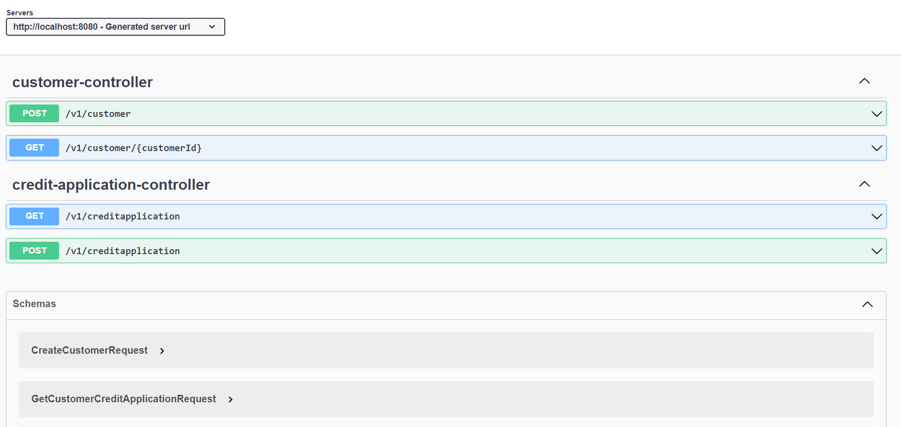
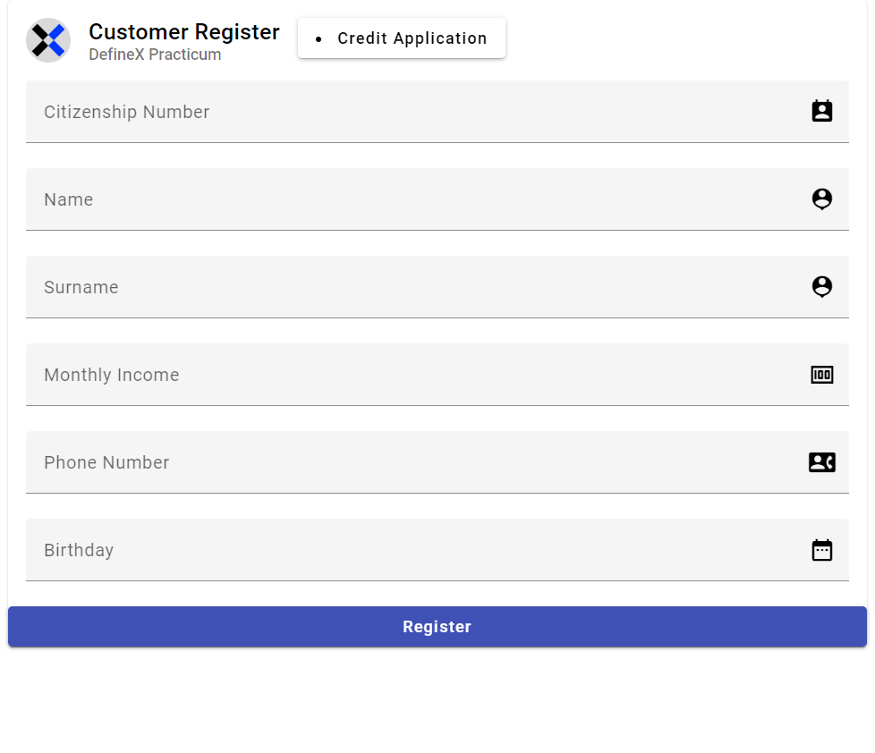
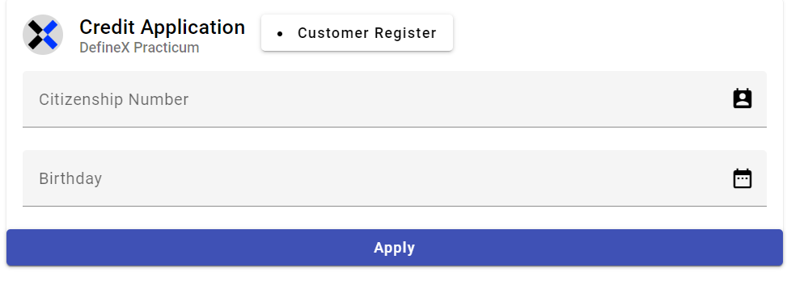

## About of Credit Application
Application developed for a *credit application* system. An application has been developed to receive loan application requests and send the loan result back to the customer according to the relevant criteria.

* New users can be added, updated or deleted to the system.

* Based on the credit score, the system can success or reject a credit application.

* Customer debts can be seen.

* All credit applications can be viewed.

* The customer's credit applications can be viewed.

#### Credit Application Front-end
* [Github]()

## Outputs

